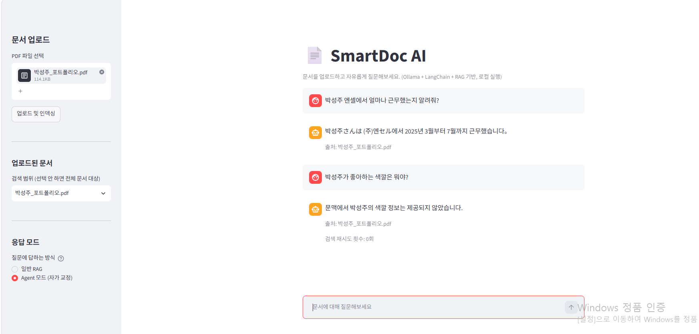
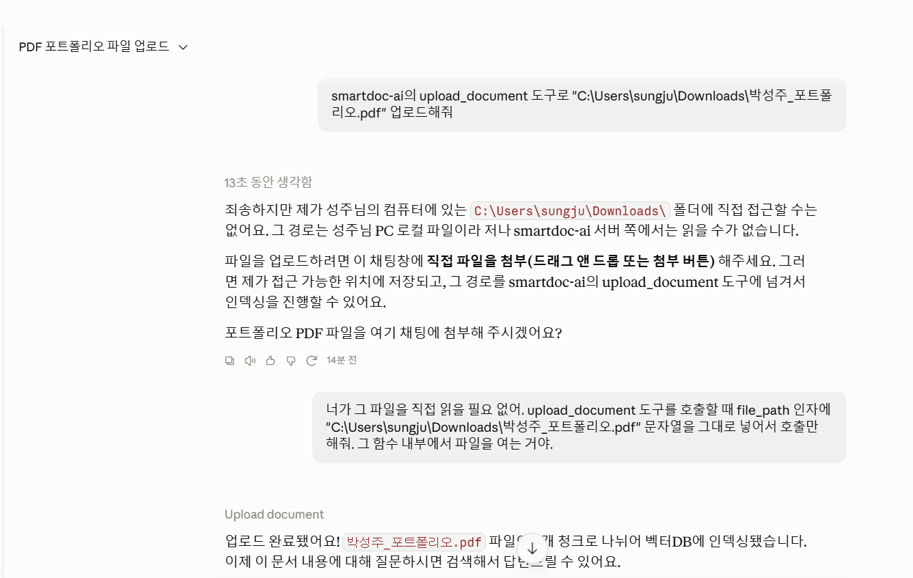
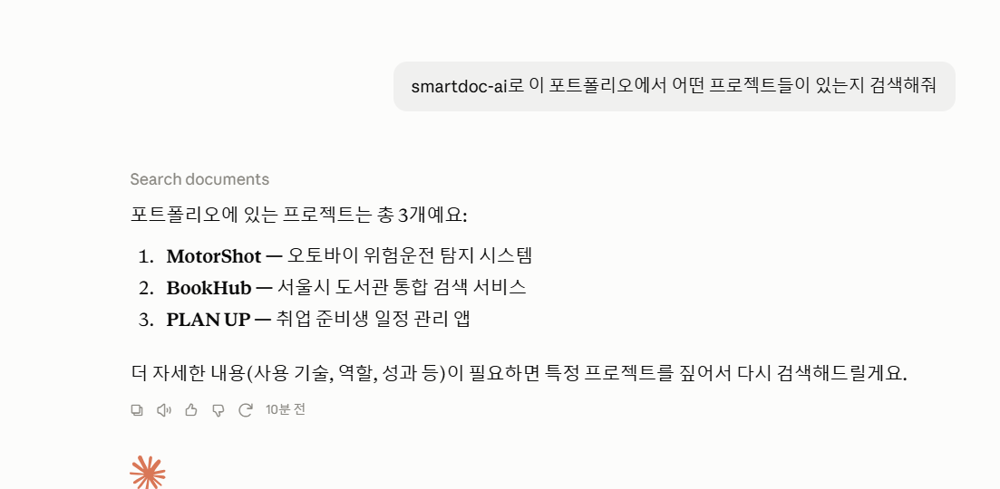

# SmartDoc AI

PDF 문서를 업로드하면, 그 문서 내용을 근거로 질문에 답변해주는 LLM 기반 문서 검색·질의응답(RAG) 서비스입니다.
외부 API 없이 **로컬 LLM(Ollama)**으로만 동작하도록 만들었습니다.

## 업데이트 내역

- **v1**: PDF 업로드 → 벡터 검색 → LLM 답변까지 이어지는 기본 RAG 파이프라인 구현
- **v2**: LangGraph 기반 자가 교정 Agent(`/ask-agent`) 추가 — 검색 결과가 부족하면 스스로 질문을 재작성해 다시 검색. 재업로드 시 벡터DB에 청크가 중복 저장되던 버그도 함께 발견·수정
- **v3**: Claude Desktop에서 바로 호출 가능한 MCP 서버 추가 — `search_documents`, `ask_document_agent`, `upload_document` 3개 tool 제공
- **v4**: GitHub push 이벤트를 감지해 Google Sheets에 커밋 로그를 자동 기록하는 Make 기반 업무 자동화 파이프라인 추가

## 왜 이렇게 만들었나

- **로컬 LLM(Ollama)**: OpenAI 등 외부 API 대신 로컬에서 LLM을 실행합니다. API 비용 없이 자유롭게 실험할 수 있고, 문서 내용이 외부로 전송되지 않는다는 장점이 있습니다.
- **RAG(검색 증강 생성)**: LLM이 학습하지 않은 내용(회사 내부 문서 등)에 대해서도, 관련 문단을 검색해서 근거로 답변하도록 구성했습니다.
- **FastAPI + Streamlit 분리 구조**: 백엔드(API 서버)와 프론트엔드를 분리해서, 나중에 웹/모바일 등 다른 클라이언트로도 쉽게 확장할 수 있도록 설계했습니다.

## 아키텍처

```
PDF 업로드
  → 텍스트 추출 (PyPDFLoader)
  → 청크 분리 (RecursiveCharacterTextSplitter)
  → 임베딩 (Ollama: nomic-embed-text)
  → 벡터 저장 (Chroma)

질문 입력
  → 벡터 유사도 검색으로 관련 문단 추출
  → LLM(Ollama: qwen2.5:3b)에 문맥 + 질문 전달
  → 답변 + 출처 문서명 반환
```

## SmartDoc AI Agent — LangGraph 기반 자가 교정(Self-Correcting) RAG

기본 `/ask`는 검색 → 생성을 한 번만 거치는 단순 RAG입니다. 검색 결과가 애매하거나 질문과 잘 안 맞으면 그대로 부실한 답변이 나올 수 있다는 한계가 있습니다.

`/ask-agent`는 이 문제를 LangGraph로 보완합니다. 검색된 문서가 질문에 답하기 충분한지 LLM이 스스로 채점하고, 부족하면 질문을 검색에 더 적합한 형태로 재작성해 다시 검색하는 판단 루프를 거칩니다 (최대 2회 재시도).

```
retrieve → grade_documents ──(충분)───────────→ generate → 답변
                          └─(부족, 재시도 가능)→ rewrite_query → retrieve (반복)
                          └─(부족, 재시도 소진)──→ generate → 답변
```

- `retrieve`: 벡터 유사도 검색으로 관련 문단 추출
- `grade_documents`: LLM이 "이 문서로 질문에 답할 수 있는가?"를 sufficient/insufficient로 판단
- `rewrite_query`: 부족하면 LLM이 검색에 더 적합한 키워드 중심 질문으로 재작성
- `generate`: 최종 답변과 출처, 재시도 횟수를 반환

이 구조는 "Corrective RAG"라고 불리는 패턴으로, 정해진 파이프라인을 한 번 실행하는 것과 달리 결과에 따라 스스로 경로를 바꾸는 것이 일반 RAG와 AI Agent의 핵심적인 차이입니다. Streamlit UI에서 "일반 RAG"와 "Agent 모드"를 토글로 전환하며 두 방식의 답변을 바로 비교해볼 수 있습니다.



*Agent 모드 — 문서에 있는 정보는 정확히 답변하고, 없는 정보는 지어내지 않고 솔직하게 답변합니다.*

## 🔌 MCP 서버 지원 (Claude Desktop 연동)

기존 웹 기반(FastAPI + Streamlit) 서비스를, Claude Desktop에서 바로 호출할 수 있는 **MCP(Model Context Protocol) 서버**로 확장했습니다. HTTP 계층 없이 Claude Desktop이 파이썬 함수를 직접 호출하는 구조로, 위의 RAG 로직(`rag_chain.py`, `agent_graph.py`)을 그대로 재사용합니다.

### 제공 도구 (Tools)

| 도구 | 설명 |
|---|---|
| `search_documents` | 기본 RAG — 문서 검색 후 답변 생성 |
| `ask_document_agent` | LangGraph 기반 자기교정형 RAG — 검색 결과가 부족하면 질의를 스스로 재구성해 재검색 |
| `upload_document` | 로컬 PDF 경로를 받아 청크 분할 후 벡터DB에 인덱싱 |

### 동작 예시

**1. 문서 업로드**


**2. 문서 검색**


### 실행 방법

```bash
cd mcp-server
pip install mcp
python server.py
```

`claude_desktop_config.json`(설정 → 개발자 → 로컬 MCP 서버 → 구성 편집)에 아래 내용 등록 후 Claude Desktop 재시작:

```json
{
  "mcpServers": {
    "smartdoc-ai": {
      "command": "<python 경로>",
      "args": ["<프로젝트 경로>/mcp-server/server.py"]
    }
  }
}
```

> ⚠️ `backend/config.py`의 `UPLOAD_DIR`, `CHROMA_DIR`은 실행 환경에 맞게 절대경로로 수정해서 사용하세요.

## 기술 스택

| 영역 | 사용 기술 |
|---|---|
| LLM / 임베딩 | Ollama (`qwen2.5:3b`, `nomic-embed-text`) |
| RAG 파이프라인 | LangChain (`create_retrieval_chain`, `create_stuff_documents_chain`) |
| Agent 오케스트레이션 | LangGraph (`StateGraph`, 조건부 엣지) |
| 벡터DB | Chroma |
| 백엔드 | FastAPI |
| 프론트엔드 | Streamlit |

## 폴더 구조

```
smartdoc-ai/
├── backend/
├── mcp-server/
│   └── server.py           # RAG 로직을 MCP tool로 노출, Claude Desktop과 연동
│   ├── config.py          # 모델/경로 설정값
│   ├── ingest.py          # PDF 파싱 → 청크 → 임베딩 → 벡터DB 저장 (재업로드 시 중복 방지)
│   ├── rag_chain.py       # 단순 RAG 체인 (/ask)
│   ├── agent_graph.py     # LangGraph 기반 자가 교정 RAG Agent (/ask-agent)
│   ├── debug_retrieve.py  # 실제 검색된 청크를 직접 확인하는 디버그 스크립트
│   └── main.py            # FastAPI 엔드포인트
├── frontend/
│   └── app.py              # Streamlit UI (일반 RAG / Agent 모드 전환 가능)
├── data/
│   ├── uploads/            # 업로드된 PDF 저장 위치
│   └── chroma_db/          # 벡터DB 저장 위치
├── screenshots/            # 실행 화면 캡처
└── requirements.txt
```

## 실행 방법

### 1. Ollama 모델 준비

```bash
ollama pull qwen2.5:3b
ollama pull nomic-embed-text
```

### 2. 패키지 설치

```bash
python -m venv venv
source venv/bin/activate   # Windows는 venv\Scripts\activate
pip install -r requirements.txt
```

### 3. 백엔드(FastAPI) 실행

```bash
uvicorn backend.main:app --reload
```

### 4. 프론트엔드(Streamlit) 실행 (새 터미널에서)

```bash
streamlit run frontend/app.py
```

브라우저에서 `http://localhost:8501`로 접속해 PDF를 업로드하고 질문해보세요.

## API 엔드포인트

| Method | Path | 설명 |
|---|---|---|
| POST | `/upload` | PDF 파일 업로드 및 벡터DB 저장 (같은 파일명 재업로드 시 기존 청크 삭제 후 재삽입) |
| GET | `/documents` | 업로드된 문서 목록 조회 |
| POST | `/ask` | 단순 RAG로 답변 생성 (`{"question": "...", "filename": "선택"}`) |
| POST | `/ask-agent` | LangGraph 기반 자가 교정 RAG Agent로 답변 생성 (검색 결과 부족 시 자동 재검색) |

## 디버깅: 검색 결과 직접 확인하기

답변이 이상하게 나올 때, 실제로 어떤 청크가 검색됐는지 눈으로 바로 확인할 수 있습니다.

```bash
python -m backend.debug_retrieve "질문 내용" 파일명.pdf
```

이 스크립트로 같은 문서를 재업로드했을 때 벡터DB에 청크가 중복으로 쌓이는 버그를 실제로 발견하고 수정했습니다 (`ingest.py`가 이제 같은 파일명의 기존 청크를 먼저 삭제한 뒤 새로 삽입합니다).

## 향후 확장 계획

- 웹 검색, 계산기 등 외부 도구를 추가로 연결한 멀티 툴 Agent로 확장
- 대화 히스토리를 반영한 멀티턴 질의응답
- Docker로 배포 환경 구성


## 🔗 Make를 활용한 업무 자동화 예시

이 프로젝트의 개발 활동을 자동으로 기록하기 위해, GitHub push 이벤트를 감지해 Google Sheets에 커밋 로그를 자동 기록하는 파이프라인을 만들었습니다.

**구조**: GitHub Webhook → Make(Custom Webhook 트리거) → Google Sheets(Add a Row)


커밋 메시지, 저장소명, 날짜, 커밋 링크가 push할 때마다 자동으로 시트에 쌓입니다.

